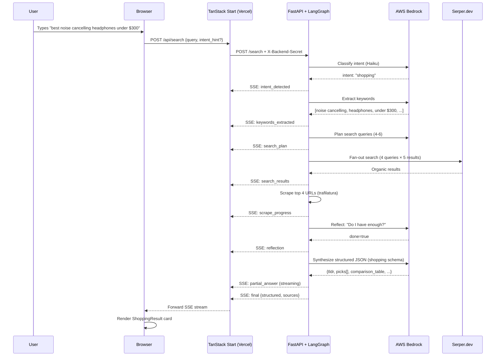

# Lensr — Architecture Documentation

> A comprehensive guide to the end-to-end system for anyone who needs to understand, maintain, or extend the project.

---

## 1. System Overview

**Lensr** is an AI-powered search engine that classifies user queries by intent and returns structured, category-specific answer cards — not just blue links. Each query flows through a multi-agent pipeline that searches the web, scrapes content, reflects on quality, and synthesizes a structured JSON response tailored to the detected intent (shopping comparison, trip itinerary, recipe, price history, etc.).

### Key Differentiators

- **Intent-aware results** — 10 backend intents, 20 UI categories, each with a purpose-built result card
- **Guaranteed media** — Every result has a real image (Wikipedia → OG → AI fallback)
- **Guaranteed CTAs** — Amazon, Maps, Booking, etc. injected even when the LLM omits them
- **Live streaming** — SSE-based pipeline visibility (intent → keywords → search → reflection → answer)
- **Multi-agent architecture** — LangGraph StateGraphs with reflection loops and quality gates

---

## 2. Architecture Diagram

```
┌─────────────────────────────────────────────────────────────────┐
│                         BROWSER                                  │
│  React 19 · TanStack Router · Tailwind v4 · shadcn/ui           │
│                                                                  │
│  Routes: / (search) · /results (SSE stream) · /insta (upload)   │
│          /auth (sign-in) · /saved · /admin (API keys)           │
└────────┬─────────────────────────────────────┬──────────────────┘
         │ supabase-js (auth, DB, storage)     │ POST /api/search
         ▼                                     ▼
┌────────────────────────┐      ┌──────────────────────────────────┐
│   Supabase (Postgres)  │      │   TanStack Start (Vercel)        │
│                        │      │                                  │
│  • auth.users          │      │   POST /api/search               │
│  • profiles            │      │    → proxy to Python backend     │
│  • user_roles          │      │    → returns SSE stream          │
│  • api_keys (admin)    │      │                                  │
│  • saved_searches      │      │   createServerFn RPCs:           │
│  • storage: insta-imgs │      │    • listApiKeys                 │
│                        │      │    • upsertApiKey                │
│  RLS on all tables     │      │    • deleteApiKey                │
│  has_role() helper     │      │    • checkIsAdmin                │
└────────────────────────┘      └──────────────┬───────────────────┘
                                               │ HTTPS + X-Backend-Secret
                                               ▼
┌─────────────────────────────────────────────────────────────────┐
│            Python Backend (FastAPI + LangGraph)                  │
│                                                                  │
│  POST /search → text/event-stream                                │
│                                                                  │
│  ┌─────────────┐                                                │
│  │ Router Graph │─── classify intent (Bedrock Haiku) ──┐        │
│  └─────────────┘                                       ▼        │
│    ┌── shopping_graph ──┐                                       │
│    ├── price_graph ─────┤   each = LangGraph StateGraph:        │
│    ├── trip_graph ──────┤     keywords → plan → search          │
│    ├── insta_graph ─────┤     → scrape → reflect → synthesize   │
│    └── general_graph ───┘                                       │
│                                                                  │
│  External Services:                                             │
│    • AWS Bedrock (Claude 3.5 Sonnet, Haiku, Vision)             │
│    • Serper.dev (Google SERP API)                                │
│    • trafilatura (web content extraction)                        │
└─────────────────────────────────────────────────────────────────┘
```

---

## 3. Tech Stack

| Layer                   | Technology                       | Purpose                                                |
| ----------------------- | -------------------------------- | ------------------------------------------------------ |
| **Frontend Framework**  | TanStack Start v1                | Full-stack SSR framework with file-based routing       |
| **UI Library**          | React 19                         | Component rendering                                    |
| **Styling**             | Tailwind CSS v4 + shadcn/ui      | Utility-first CSS with pre-built Radix components      |
| **State Management**    | TanStack React Query v5          | Server state caching and synchronization               |
| **Routing**             | TanStack Router v1               | Type-safe file-based routing                           |
| **Backend Framework**   | FastAPI                          | Async Python web framework                             |
| **Agent Orchestration** | LangGraph                        | Multi-agent state machine graphs                       |
| **LLM Provider**        | AWS Bedrock                      | Claude 3.5 Sonnet (reasoning), Haiku (routing), Vision |
| **Search API**          | Serper.dev                       | Google SERP results as structured JSON                 |
| **Web Scraping**        | trafilatura                      | Clean text extraction from HTML                        |
| **Database**            | Supabase (PostgreSQL)            | Auth, RLS, storage, user data                          |
| **Hosting (Frontend)**  | Vercel                           | Edge deployment at lensr.studio                        |
| **Hosting (Backend)**   | Docker (AWS App Runner / Fly.io) | Containerized Python service                           |

---

## 4. Request Flow: Query → Result Card



---

## 5. Agent System

### 5.1 Router Graph (`backend/app/router_graph.py`)

The top-level graph classifies the user's query into one of 10 intents using Bedrock Haiku (fast, cheap), then dispatches to the appropriate per-intent agent.

### 5.2 Shared Pipeline (`backend/app/agents/_pipeline.py`)

Every agent follows the same core pipeline:

1. **Extract Keywords** — LLM extracts 5-8 search terms, named entities, and constraints
2. **Plan Queries** — LLM generates 4-6 diverse Google search queries covering different angles
3. **Fan-out Search** — Calls Serper.dev for each query (5 results each = 20-30 total URLs)
4. **Scrape Top-N** — Uses trafilatura to extract clean text from the top 4 most relevant URLs
5. **Reflect** — LLM evaluates: "Do I have enough evidence to answer well?" If not, generates follow-up queries and loops (max 3 iterations)
6. **Synthesize** — LLM produces intent-specific structured JSON following a strict schema

### 5.3 Per-Intent Agents

| Agent         | File                      | Output Schema                                                      |
| ------------- | ------------------------- | ------------------------------------------------------------------ |
| Shopping      | `agents/shopping.py`      | `{tldr, picks[], comparison_table, detail_markdown}`               |
| Price History | `agents/price_history.py` | `{tldr, price_points[], buy_now_score, sale_windows[]}`            |
| Trip Planning | `agents/trip.py`          | `{tldr, destination, days[], budget_hint, packing_tips[]}`         |
| Instagram     | `agents/insta.py`         | `{tldr, scene, mood, captions[], hashtags[], place_suggestions[]}` |
| General       | `agents/general.py`       | `{tldr, key_facts[], detail_markdown}`                             |

### 5.4 LLM Configuration (`backend/app/llm.py`)

Three model tiers via AWS Bedrock:

- **Router** (Haiku) — Fast intent classification, keyword extraction
- **Reasoning** (Claude 3.5 Sonnet) — Synthesis, reflection, complex reasoning
- **Vision** (Claude 3.5 Sonnet) — Image analysis for Instagram captions

---

## 6. Database Schema

### Tables

| Table                   | Purpose                        | RLS Policy                        |
| ----------------------- | ------------------------------ | --------------------------------- |
| `auth.users`            | Supabase-managed user accounts | Managed by Supabase               |
| `public.profiles`       | Display name, avatar, email    | User sees/edits own only          |
| `public.user_roles`     | Role assignments (admin/user)  | User reads own; admin manages all |
| `public.api_keys`       | Backend API key storage        | Admin-only read + write           |
| `public.saved_searches` | User search history            | User manages own only             |

### Key Functions

- `has_role(user_id UUID, role app_role)` — SECURITY DEFINER helper that checks role membership without triggering recursive RLS
- `handle_new_user()` — Trigger on `auth.users` INSERT that creates a `profiles` row and assigns the `user` role

### Storage Buckets

- `insta-images` — User-uploaded photos for Instagram caption analysis, scoped by `user_id` folder

---

## 7. Authentication

### Flow

1. **Email/Password** — Standard Supabase `signUp` / `signInWithPassword`
2. **Google OAuth** — `supabase.auth.signInWithOAuth({ provider: "google" })`, configured in Supabase Dashboard
3. **Session** — JWT stored in browser, attached to API calls via `attachSupabaseAuth` middleware

### Roles

| Role             | Capabilities                                               |
| ---------------- | ---------------------------------------------------------- |
| `user` (default) | Search, save results, upload images, manage own profile    |
| `admin`          | All user permissions + manage API keys + manage user roles |

### RLS Enforcement

All database access goes through Supabase RLS policies. Server functions use `requireSupabaseAuth` middleware to validate JWT tokens before any privileged operation.

---

## 8. Deployment

### Frontend (Vercel)

1. Connect GitHub repo to Vercel
2. Set environment variables:
   - `VITE_SUPABASE_URL`
   - `VITE_SUPABASE_PUBLISHABLE_KEY`
   - `BACKEND_BASE_URL`
   - `BACKEND_SHARED_SECRET`
3. Custom domain: `lensr.studio`
4. Auto-deploys on push to `main`

### Backend (Docker)

```bash
cd backend
docker build -t lensr-backend .
docker run -p 8000:8000 --env-file .env lensr-backend
```

Recommended platforms: AWS App Runner (close to Bedrock), Fly.io, Render.

---

## 9. Environment Variables Reference

### Frontend (Vercel — server runtime)

| Variable                        | Required | Description                                           |
| ------------------------------- | -------- | ----------------------------------------------------- |
| `VITE_SUPABASE_URL`             | Yes      | Supabase project URL                                  |
| `VITE_SUPABASE_PUBLISHABLE_KEY` | Yes      | Supabase anon/public key                              |
| `BACKEND_BASE_URL`              | Yes      | Python backend URL (e.g., `https://api.lensr.studio`) |
| `BACKEND_SHARED_SECRET`         | Yes      | Shared secret for backend authentication              |

### Python Backend

| Variable                  | Required | Description                                               |
| ------------------------- | -------- | --------------------------------------------------------- |
| `AWS_REGION`              | Yes      | AWS region for Bedrock (e.g., `us-east-1`)                |
| `AWS_ACCESS_KEY_ID`       | Yes\*    | AWS credentials (\*or use IAM role)                       |
| `AWS_SECRET_ACCESS_KEY`   | Yes\*    | AWS credentials (\*or use IAM role)                       |
| `BEDROCK_MODEL_REASONING` | No       | Default: `anthropic.claude-3-5-sonnet-20241022-v2:0`      |
| `BEDROCK_MODEL_ROUTER`    | No       | Default: `anthropic.claude-3-haiku-20240307-v1:0`         |
| `BEDROCK_MODEL_VISION`    | No       | Default: `anthropic.claude-3-5-sonnet-20241022-v2:0`      |
| `SERPER_API_KEY`          | Yes      | Serper.dev Google Search API key                          |
| `DATABASE_URL`            | No       | PostgreSQL URL for price history storage                  |
| `BACKEND_SHARED_SECRET`   | Yes      | Must match frontend's `BACKEND_SHARED_SECRET`             |
| `CORS_ALLOW_ORIGIN`       | No       | Default: `*`; set to `https://lensr.studio` in production |

---

## 10. Security

### SSRF Protection

- `isPublicHttpUrl()` blocks localhost, `.internal`, `.local`, private IP ranges (10.x, 172.16-31.x, 192.168.x), link-local (169.254.x), and all IPv6
- Image fetches use `redirect: "manual"` with at most one same-origin hop

### Row-Level Security

- Every `public.*` table has RLS enabled
- `anon` role has no access to sensitive tables
- Admin operations gated by `has_role(auth.uid(), 'admin')`

### Secret Management

- `X-Backend-Secret` header authenticates frontend → backend communication
- API keys stored in `api_keys` table (admin-only access)
- No secrets exposed to client-side code

### Error Handling

- FastAPI returns generic `"Internal server error"` — no stack traces leaked
- Frontend error boundary catches and displays user-friendly messages

---

## 11. Project Structure

```
├── src/
│   ├── routes/
│   │   ├── index.tsx              # Home: SearchBar + CategoryGrid
│   │   ├── results.tsx            # SSE consumer + result rendering
│   │   ├── insta.tsx              # Image upload → caption agent
│   │   ├── auth.tsx               # Sign-in/up (email + Google OAuth)
│   │   ├── _authenticated/        # Protected routes
│   │   │   ├── saved.tsx          # User's saved searches
│   │   │   └── admin.tsx          # API key management
│   │   └── api/
│   │       └── search.ts          # SSE proxy to Python backend
│   ├── components/
│   │   ├── SearchBar.tsx
│   │   ├── ResultsStream.tsx      # SSE event processor
│   │   ├── CategoryGrid.tsx       # 20-category grid
│   │   └── results/               # Per-intent result cards
│   │       ├── ShoppingResult.tsx
│   │       ├── TripResult.tsx
│   │       ├── PriceHistoryResult.tsx
│   │       ├── InstaResult.tsx
│   │       ├── MoviesResult.tsx
│   │       ├── BooksResult.tsx
│   │       ├── RecipesResult.tsx
│   │       ├── PlacesResult.tsx
│   │       ├── EventsResult.tsx
│   │       ├── GeneralResult.tsx
│   │       ├── AgentTimeline.tsx   # Pipeline step visualization
│   │       └── SourcesGrid.tsx    # Source attribution
│   ├── integrations/supabase/     # Auto-generated client + middleware
│   └── lib/
│       ├── api-keys.functions.ts  # Admin CRUD RPCs
│       ├── required-keys.ts       # Backend key registry
│       └── search/
│           ├── types.ts           # SSE + structured payload types
│           └── categories.ts      # 20-category definitions
├── backend/
│   ├── app/
│   │   ├── main.py               # FastAPI app + SSE endpoint
│   │   ├── config.py             # Environment settings
│   │   ├── llm.py                # Bedrock model wrappers
│   │   ├── router_graph.py       # Intent classification + dispatch
│   │   └── agents/
│   │       ├── _pipeline.py      # Shared search pipeline
│   │       ├── shopping.py
│   │       ├── price_history.py
│   │       ├── trip.py
│   │       ├── insta.py
│   │       └── general.py
│   ├── Dockerfile
│   └── pyproject.toml
├── supabase/
│   ├── config.toml
│   └── migrations/               # Schema + RLS policies
├── vercel.json                    # Vercel deployment config
├── vite.config.ts                 # TanStack Start + React + Tailwind
└── package.json
```
